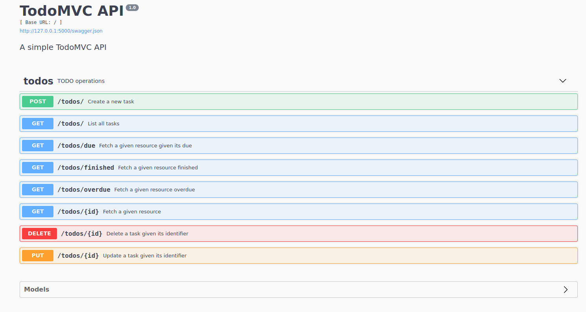

# Todo API

first run init_db.py to initialise database

Link to [video demonstration](https://drive.google.com/drive/folders/1lKc6PdsKq-SZpcqUvruy0dyvQkFylzzD?usp=sharing). Day of recording is 23 may 2021

